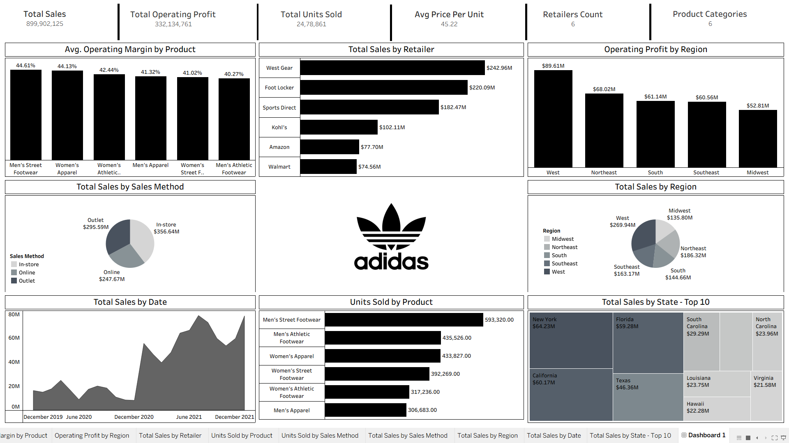

# Adidas Sales Analysis – Tableau Dashboard

## 📊 Project Overview

This project presents an interactive **Adidas Sales & Profit Analysis Dashboard** built using **Tableau**.

The dashboard analyzes sales performance across products, retailers, regions, states, sales methods, and time periods to identify key business trends and performance drivers.

## 🎯 Project Objectives

* Analyze overall sales and operating profit
* Compare sales performance across retailers
* Evaluate operating profit across regions
* Analyze operating margins by product
* Compare sales across different sales methods
* Identify products with the highest units sold
* Analyze sales trends over time
* Identify top-performing states
* Compare regional sales performance

## 📌 Key Performance Indicators

* **Total Sales:** $899.90M
* **Total Operating Profit:** $332.13M
* **Total Units Sold:** 24.78M
* **Average Price per Unit:** $45.22
* **Retailers:** 6
* **Product Categories:** 6

## 📈 Dashboard Analysis

### 1. Average Operating Margin by Product

Compares operating margins across Adidas product categories to identify products with stronger profitability.

### 2. Total Sales by Retailer

Analyzes sales contribution from different retailers and highlights the strongest-performing retail partners.

### 3. Operating Profit by Region

Compares operating profit across regions to identify the most profitable markets.

### 4. Total Sales by Sales Method

Analyzes sales generated through:

* In-store
* Online
* Outlet

### 5. Total Sales by Region

Shows the contribution of each region to overall Adidas sales.

### 6. Total Sales by Date

Tracks sales performance over time and highlights changes in sales trends.

### 7. Units Sold by Product

Compares product categories based on units sold and identifies high-volume products.

### 8. Total Sales by State – Top 10

Uses geographic analysis to identify the highest-performing states based on total sales.

## 💡 Key Business Insights

* **West Gear** generates the highest total sales among the analyzed retailers.
* The **West region** records the highest operating profit.
* **Men's Street Footwear** has the highest average operating margin among the displayed products.
* **In-store sales** contribute the largest share among the three sales methods.
* **Men's Street Footwear** records the highest number of units sold.
* **New York** and **California** are among the top-performing states by total sales.
* Regional and product-level analysis helps identify areas with strong sales and profitability.

## 🛠️ Tools & Technologies

* **Tableau**
* **Microsoft Excel**
* Data Cleaning
* Data Analysis
* Data Visualization
* Calculated Fields
* KPI Analysis
* Geographic Analysis
* Time-Series Analysis
* Dashboard Design

## 📂 Project Files

```text
Adidas-Sales-Analysis-Tableau/
│
├── README.md
├── Adidas_Sales_Dashboard.twbx
├── Adidas_Sales_Dashboard.png
└── adidas.xlsx
```

## 🖼️ Dashboard Preview



## 🚀 Skills Demonstrated

**Tableau | Excel | Data Analysis | Data Visualization | Business Intelligence | KPI Development | Sales Analysis | Profitability Analysis | Geographic Analysis | Dashboard Design**

## 👤 Author

**Somya Singhal**

Aspiring Data Analyst | Tableau | Power BI | Excel | SQL
